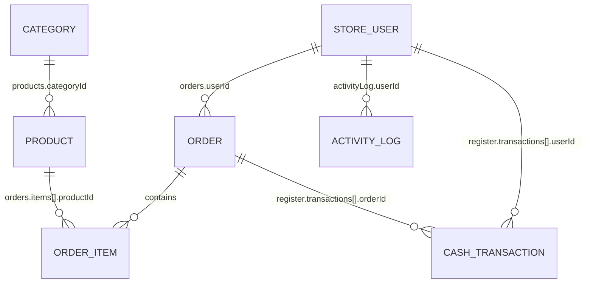

# JSON to SQLite Migration Audit

**Date:** 2026-03-17  
**Scope:** Current JSON-backed data system analysis  
**Source Anchor:** All claims reference specific files and line numbers  

---

## Executive Summary

This audit documents the current state of the JSON-backed data system in the Merbana application. All observations are strictly factual, derived from code inspection and current JSON structure. No target-state schema proposals are included.

---

## 1. Top-Level Keys Inventory

**Source Anchor:** `public/data/db.json` (lines 1-16)

The current on-disk JSON contains the following top-level keys:

| Key | Disk Type | Runtime Type | Interface Source |
|-----|-----------|--------------|------------------|
| `categories` | `[]` (empty array) | `Category[]` | `src/types/types.ts:37-40` |
| `products` | `[]` (empty array) | `Product[]` | `src/types/types.ts:1-10` |
| `orders` | `[]` (empty array) | `Order[]` | `src/types/types.ts:24-35` |
| `register` | `{currentBalance: 0, transactions: []}` | `RegisterState` | `src/types/types.ts:110-113` |
| `users` | `[]` (empty array) | `StoreUser[]` | `src/types/types.ts:42-47` |
| `activityLog` | `[]` (empty array) | `ActivityLog[]` | `src/types/types.ts:49-55` |
| `settings` | `{companyName: ""}` | `StoreSettings` | `src/types/types.ts:74-77` |
| `debtors` | `[]` (empty array) | `Debtor[]` | `src/types/types.ts:79-86` |
| `lastStockReset` | `""` (empty string) | `string` | `src/types/types.ts:97` |

---

## 2. Runtime Fallback Behavior

**Source Anchor:** `src/services/database.ts:98-109` (loadDatabase function)

The runtime applies the following defensive fallbacks when loading data:

```typescript
db = {
  products:    Array.isArray(data.products)    ? data.products    : [],
  categories:  Array.isArray(data.categories)  ? data.categories  : [],
  orders:      Array.isArray(data.orders)      ? data.orders      : [],
  register:    data.register  || { currentBalance: 0, transactions: [] },
  users:       Array.isArray(data.users)       ? data.users       : [],
  activityLog: Array.isArray(data.activityLog) ? data.activityLog : [],
  settings: mergeSettings(data.settings),  // Deep merge with defaults
  debtors:     Array.isArray(data.debtors)     ? data.debtors     : [],
  lastStockReset: data.lastStockReset || '',
};
```

**Key Finding:** All array fields default to empty arrays. The `register` object has a complete default structure. `settings` undergoes deep merging.

---

## 3. Field-Level Inventory

### 3.1 Product Entity

**Source Anchors:**
- Interface: `src/types/types.ts:1-10`
- Runtime fallback: `src/services/database.ts:191-196` (addProduct)

| Field | Type | Optional | Disk Presence | Runtime Default | Notes |
|-------|------|----------|---------------|-----------------|-------|
| `id` | `string` | No | Generated | `uuidv4()` | Assigned at creation |
| `name` | `string` | No | Yes | N/A | Required field |
| `price` | `number` | No | Yes | N/A | Required field |
| `categoryId` | `string` | Yes | Conditional | `undefined` | Written only if provided |
| `sizes` | `{name: string, price: number}[]` | Yes | Conditional | `undefined` | Written only if non-empty |
| `createdAt` | `string` (ISO date) | No | Yes | `new Date().toISOString()` | Auto-generated |
| `stock` | `number` | Yes | Conditional | `undefined` | Only when `trackStock=true` |
| `trackStock` | `boolean` | Yes | Conditional | `undefined` | Determines stock tracking |

### 3.2 Order Entity

**Source Anchors:**
- Interface: `src/types/types.ts:24-35`
- Creation: `src/services/database.ts:275-308` (addOrder)

| Field | Type | Optional | Disk Presence | Runtime Default | Notes |
|-------|------|----------|---------------|-----------------|-------|
| `id` | `string` | No | Yes | `uuidv4()` | Auto-generated |
| `orderNumber` | `number` | No | Yes | Sequential (1-100) | Cycles 1-100 based on max |
| `date` | `string` (ISO date) | No | Yes | `new Date().toISOString()` | Auto-generated |
| `items` | `OrderItem[]` | No | Yes | Provided | See 3.2.1 |
| `total` | `number` | No | Yes | Calculated | Sum of item subtotals |
| `paymentMethod` | `'cash' \| 'shamcash'` | No | Yes | `'cash'` | Default if not provided |
| `orderType` | `'dine_in' \| 'takeaway'` | No | Yes | `'dine_in'` | Default if not provided |
| `note` | `string` | Yes | Conditional | `undefined` | Written only if provided |
| `userId` | `string` | Yes | Conditional | `undefined` | Written only if provided |
| `userName` | `string` | Yes | Conditional | `undefined` | Written only if provided |

#### 3.2.1 OrderItem Sub-entity

**Source Anchor:** `src/types/types.ts:12-19`

| Field | Type | Optional | Notes |
|-------|------|----------|-------|
| `productId` | `string` | No | References products.id |
| `name` | `string` | No | Product name at order time |
| `price` | `number` | No | Unit price at order time |
| `quantity` | `number` | No | Item quantity |
| `size` | `string` | Yes | Optional size variant |
| `subtotal` | `number` | No | price × quantity |

### 3.3 Category Entity

**Source Anchor:** `src/types/types.ts:37-40`

| Field | Type | Optional | Notes |
|-------|------|----------|-------|
| `id` | `string` | No | `uuidv4()` generated |
| `name` | `string` | No | Category name |

### 3.4 StoreUser Entity

**Source Anchor:** `src/types/types.ts:42-47`

| Field | Type | Optional | Disk Presence | Notes |
|-------|------|----------|---------------|-------|
| `id` | `string` | No | Yes | `uuidv4()` generated |
| `name` | `string` | No | Yes | User display name |
| `password` | `string` | Yes | Conditional | Written only if provided |
| `createdAt` | `string` (ISO date) | No | Yes | Auto-generated |

### 3.5 ActivityLog Entity

**Source Anchor:** `src/types/types.ts:49-55`

| Field | Type | Optional | Notes |
|-------|------|----------|-------|
| `id` | `string` | No | `uuidv4()` generated |
| `userId` | `string` | No | References users.id |
| `userName` | `string` | No | Denormalized username |
| `action` | `string` | No | Action description |
| `timestamp` | `string` (ISO date) | No | Auto-generated |

### 3.6 RegisterState Entity

**Source Anchor:** `src/types/types.ts:110-113`

| Field | Type | Optional | Notes |
|-------|------|----------|-------|
| `currentBalance` | `number` | No | Running cash balance |
| `transactions` | `CashTransaction[]` | No | Transaction history |

#### 3.6.1 CashTransaction Sub-entity

**Source Anchor:** `src/types/types.ts:100-108`

| Field | Type | Optional | Notes |
|-------|------|----------|-------|
| `id` | `string` | No | `uuidv4()` generated |
| `type` | `'sale' \| 'deposit' \| 'withdrawal' \| 'shift_close'` | No | Transaction type |
| `amount` | `number` | No | Signed amount |
| `note` | `string` | Yes | Optional description |
| `date` | `string` (ISO date) | No | Auto-generated |
| `orderId` | `string` | Yes | References orders.id |
| `userId` | `string` | Yes | References users.id |

### 3.7 StoreSettings Entity (Critical Shape Mismatch)

**Source Anchors:**
- Interface: `src/types/types.ts:74-77`
- Disk shape: `public/data/db.json:11-13`
- Runtime merge: `src/services/database.ts:13-33` (mergeSettings)

**On-Disk Shape:**
```json
{
  "settings": {
    "companyName": ""
  }
}
```

**Runtime-Normalized Shape:**
```typescript
{
  companyName: string;
  security: {
    passwordRequiredFor: PasswordRequirementMap;  // 9 boolean keys
  };
}
```

**Key Finding:** The disk only stores `companyName`, while runtime merges complete security defaults via `mergeSettings()` function. This is a documented shape mismatch where runtime provides defaults for missing disk fields.

**Default Security Settings Source:** `src/utils/passwordPolicy.ts:17-27`

All 9 sensitive actions default to `true` (password required):
- `create_order`, `delete_order`, `deposit_cash`, `withdraw_cash`, `close_shift`, `add_debtor`, `mark_debtor_paid`, `delete_debtor`, `import_database`

### 3.8 Debtor Entity

**Source Anchor:** `src/types/types.ts:79-86`

| Field | Type | Optional | Disk Presence | Notes |
|-------|------|----------|---------------|-------|
| `id` | `string` | No | Yes | `uuidv4()` generated |
| `name` | `string` | No | Yes | Debtor name |
| `amount` | `number` | No | Yes | Debt amount |
| `note` | `string` | Yes | Conditional | Written only if provided |
| `createdAt` | `string` (ISO date) | No | Yes | Auto-generated |
| `paidAt` | `string` (ISO date) | Yes | Conditional | Set when marked paid |

---

## 4. Implied Relationships

**Source Anchors:** Various query and mutation functions in `src/services/database.ts`

### 4.1 Relationship Map



### 4.2 Referential Integrity Analysis

| Relationship | From Field | To Entity | Enforcement Level | Source Anchor |
|--------------|------------|-----------|-------------------|---------------|
| Product → Category | `products.categoryId` | `categories.id` | **Best-effort** | `src/pages/ProductsPage.tsx:253` (shows "تصنيف محذوف" if missing) |
| OrderItem → Product | `orders.items[].productId` | `products.id` | **Unenforced** | Historical orders may reference deleted products |
| Transaction → Order | `register.transactions[].orderId` | `orders.id` | **Best-effort** | `src/services/database.ts:323-327` (deletes matching tx on order delete) |
| Transaction → User | `register.transactions[].userId` | `users.id` | **Unenforced** | No validation at write time |
| Order → User | `orders.userId` | `users.id` | **Unenforced** | Optional field, no FK check |
| ActivityLog → User | `activityLog.userId` | `users.id` | **Unenforced** | No cascade behavior |

### 4.3 Delete Behavior & Orphan Scenarios

**Source Anchors:** Delete functions in `src/services/database.ts`

#### 4.3.1 Product Deletion
- **Function:** `deleteProduct()` (lines 206-211)
- **Behavior:** Simple array filter, no referential checks
- **Orphan Risk:** Historical orders retain `productId` references to deleted products
- **UI Handling:** `src/pages/ProductsPage.tsx:253` displays "تصنيف محذوف" for missing categories

#### 4.3.2 Category Deletion
- **Function:** `deleteCategory()` (lines 178-184)
- **Behavior:** **Guarded** - Returns `false` if any product references the category
- **Check:** `if (db.products.some(p => p.categoryId === id)) return false;`
- **Orphan Risk:** None - deletion is blocked if products exist

#### 4.3.3 Order Deletion
- **Function:** `deleteOrder()` (lines 314-332)
- **Behavior:** Multi-stage side effects:
  1. Restores stock for all tracked products (lines 318-321)
  2. Removes associated cash transaction and reverses balance (lines 323-327)
  3. Removes order from array (line 329)
- **Orphan Risk:** Activity logs may reference deleted orders (via denormalized data)

#### 4.3.4 User Deletion
- **Function:** `deleteUser()` (lines 144-149)
- **Behavior:** Simple array filter, no referential checks
- **Orphan Risk:** 
  - Activity logs retain `userId` and `userName` (denormalized)
  - Cash transactions retain `userId`
  - Orders retain `userId` and `userName`

---

## 5. Queried, Filtered, Sorted & Aggregated Fields

**Source Anchors:** Page components and utility functions

### 5.1 Orders Queries

**Source:** `src/pages/OrdersPage.tsx`, `src/utils/reportUtils.ts`

| Field | Operation | Source Location |
|-------|-----------|-----------------|
| `orders.date` | Filter (today), Sort (desc), Date range | `OrdersPage.tsx:37-40, 43`, `reportUtils.ts:79-84` |
| `orders.orderNumber` | Filter (search), Display | `OrdersPage.tsx:46, 138` |
| `orders.items[].name` | Filter (search), Display | `OrdersPage.tsx:47, 153` |
| `orders.total` | Aggregate (sum), Display | `OrdersPage.tsx:41, 160`, `reportUtils.ts:101, 110` |
| `orders.paymentMethod` | Filter, Aggregate (count), Display | `OrdersPage.tsx:142-149`, `reportUtils.ts:112-113` |
| `orders.orderType` | Aggregate (count) | `reportUtils.ts:115-116` |

### 5.2 Products Queries

**Source:** `src/pages/ProductsPage.tsx`

| Field | Operation | Source Location |
|-------|-----------|-----------------|
| `products.name` | Filter (search), Display | `ProductsPage.tsx:36, 250` |
| `products.categoryId` | Filter, Join (to categories) | `ProductsPage.tsx:37, 251-254` |
| `products.stock` | Display, Conditional styling | `ProductsPage.tsx:262-269` |
| `products.trackStock` | Conditional logic | `ProductsPage.tsx:259` |

### 5.3 Debtors Queries

**Source:** Debtor-related functions

| Field | Operation | Notes |
|-------|-----------|-------|
| `debtors.paidAt` | Filter (unpaid vs paid) | Empty/unset = unpaid |
| `debtors.createdAt` | Sort | Chronological ordering |

---

## 6. Mutation Matrix

**Source Anchor:** All exported functions in `src/services/database.ts`

### 6.1 User Mutations

| Function | Entity | Operation | Fields Read | Fields Written | Side Effects | Persist Path |
|----------|--------|-----------|-------------|----------------|--------------|--------------|
| `getUsers()` | User | Read | All | None | None | N/A |
| `addUser()` | User | Create | None | `id, name, password?, createdAt` | None | `/api/save-db` via `notify()` |
| `updateUser()` | User | Update | `id` (lookup) | `name?, password?` | None | `/api/save-db` via `notify()` |
| `deleteUser()` | User | Delete | `id` (lookup) | None | None | `/api/save-db` via `notify()` |

### 6.2 Activity Log Mutations

| Function | Entity | Operation | Fields Read | Fields Written | Side Effects | Persist Path |
|----------|--------|-----------|-------------|----------------|--------------|--------------|
| `logActivity()` | ActivityLog | Create | None | `id, userId, userName, action, timestamp` | None | `/api/save-db` via `notify()` |
| `getActivityLog()` | ActivityLog | Read | All | None | None | N/A |

### 6.3 Category Mutations

| Function | Entity | Operation | Fields Read | Fields Written | Side Effects | Persist Path |
|----------|--------|-----------|-------------|----------------|--------------|--------------|
| `getCategories()` | Category | Read | All | None | None | N/A |
| `addCategory()` | Category | Create | None | `id, name` | None | `/api/save-db` via `notify()` |
| `deleteCategory()` | Category | Delete | `id`, `products.categoryId` (guard check) | None | Blocked if products reference category | `/api/save-db` via `notify()` (if succeeds) |

### 6.4 Product Mutations

| Function | Entity | Operation | Fields Read | Fields Written | Side Effects | Persist Path |
|----------|--------|-----------|-------------|----------------|--------------|--------------|
| `getProducts()` | Product | Read | All | None | None | N/A |
| `addProduct()` | Product | Create | None | `id, name, price, categoryId?, sizes?, createdAt, stock?, trackStock?` | None | `/api/save-db` via `notify()` |
| `updateProduct()` | Product | Update | `id` (lookup) | `name?, price?, categoryId?, sizes?, trackStock?, stock?` | None | `/api/save-db` via `notify()` |
| `deleteProduct()` | Product | Delete | `id` (lookup) | None | None | `/api/save-db` via `notify()` |

### 6.5 Stock Management Mutations

| Function | Entity | Operation | Fields Read | Fields Written | Side Effects | Persist Path |
|----------|--------|-----------|-------------|----------------|--------------|--------------|
| `adjustStock()` | Product | Update | `id`, `trackStock` | `stock` (adjusted) | Enforces `trackStock=true` | `/api/save-db` via `notify()` |
| `bulkSetStock()` | Product | Update | `id`, `trackStock` (for each) | `stock` (absolute) | Multi-product update | `/api/save-db` via `notify()` |
| `resetAllStock()` | Product | Update | `trackStock` (for all) | `stock` (set to 0) | Daily reset operation | `/api/save-db` via `notify()` |
| `checkDailyReset()` | System | Side Effect | `lastStockReset` | `lastStockReset`, multiple `product.stock` | Calls `resetAllStock()` if date changed | `/api/save-db` via `notify()` |

### 6.6 Settings Mutations

| Function | Entity | Operation | Fields Read | Fields Written | Side Effects | Persist Path |
|----------|--------|-----------|-------------|----------------|--------------|--------------|
| `getSettings()` | Settings | Read | All (merged with defaults) | None | Deep merge with defaults | N/A |
| `updateSettings()` | Settings | Update | None | `companyName?, security?` | Deep merge with existing | `/api/save-db` via `notify()` |

### 6.7 Order Mutations (Critical Multi-Entity Side Effects)

| Function | Entity | Operation | Fields Read | Fields Written | Side Effects | Persist Path |
|----------|--------|-----------|-------------|----------------|--------------|--------------|
| `getOrders()` | Order | Read | All | None | None | N/A |
| `addOrder()` | Order | Create | `orders.orderNumber` (max calc), `products.trackStock` | `id, orderNumber, date, items, total, paymentMethod, orderType, note?, userId?, userName?` | **1.** Stock reduction for tracked products (lines 299-302)<br>**2.** Cash transaction creation (line 305)<br>**3.** Register balance update (via `addCashTransaction`) | `/api/save-db` via `notify()` |
| `getOrderById()` | Order | Read | `id` (lookup) | None | None | N/A |
| `deleteOrder()` | Order | Delete | `id` (lookup), `products.trackStock` | None | **1.** Stock restoration for tracked products (lines 318-321)<br>**2.** Cash transaction removal (lines 323-327)<br>**3.** Register balance reversal | `/api/save-db` via `notify()` |
| `getOrdersByWeek()` | Order | Read | `date` (range filter) | None | Date filtering | N/A |

### 6.8 Cash Register Mutations (Multi-Entity Side Effects)

| Function | Entity | Operation | Fields Read | Fields Written | Side Effects | Persist Path |
|----------|--------|-----------|-------------|----------------|--------------|--------------|
| `getRegister()` | RegisterState | Read | All | None | None | N/A |
| `addCashTransaction()` | CashTransaction | Create | None | `id, type, amount, note?, date, orderId?, userId?` | **Updates `register.currentBalance`** (line 363) | `/api/save-db` via `notify()` |
| `depositCash()` | CashTransaction | Create | None | Same as above | Wrapper for `addCashTransaction` | `/api/save-db` via `notify()` |
| `withdrawCash()` | CashTransaction | Create | None | Same as above | Wrapper for `addCashTransaction` | `/api/save-db` via `notify()` |
| `closeShift()` | CashTransaction | Create | None | `id, type='shift_close', amount, note?, date` | **Zeros `register.currentBalance`** (line 388) | `/api/save-db` via `notify()` |

### 6.9 Debtor Mutations

| Function | Entity | Operation | Fields Read | Fields Written | Side Effects | Persist Path |
|----------|--------|-----------|-------------|----------------|--------------|--------------|
| `getDebtors()` | Debtor | Read | All | None | None | N/A |
| `addDebtor()` | Debtor | Create | None | `id, name, amount, note?, createdAt` | None | `/api/save-db` via `notify()` |
| `markDebtorPaid()` | Debtor | Update | `id` (lookup) | `paidAt` (ISO date) | None | `/api/save-db` via `notify()` |
| `deleteDebtor()` | Debtor | Delete | `id` (lookup) | None | None | `/api/save-db` via `notify()` |

### 6.10 Import/Export Operations

| Function | Entity | Operation | Fields Read | Fields Written | Side Effects | Persist Path |
|----------|--------|-----------|-------------|----------------|--------------|--------------|
| `exportDatabase()` | Database | Read/Export | **All** | None | Creates downloadable blob | Browser download |
| `importDatabase()` | Database | Write/Import | None | **Replaces entire db object** | Validates `products` and `orders` arrays, merges defaults for other fields | `/api/save-db` via `notify()` |
| `getSnapshot()` | Database | Read | **All** (copies) | None | Returns deep copy | N/A |
| `window.injectDatabase` | Database | Write/Inject | None | **Replaces entire db object** | Same validation as import | `/api/save-db` via `notify()` |

---

## 7. Persistence Mechanism

**Source Anchors:**
- Frontend: `src/services/database.ts:44-76`
- Backend: `Deployment/merbana_launcher.py:128-143`

### 7.1 Write Behavior

Every mutation calls `notify()` which triggers:

1. **Immediate disk persistence** via `persistToDisk()`:
   - Serializes entire `db` object to JSON
   - Uses `navigator.sendBeacon('/api/save-db', blob)` if under 63KB
   - Falls back to `fetch()` with `keepalive: true` for larger payloads
   - **Writes full JSON blob every time** - no partial updates

2. **UI notification** via listener callbacks

### 7.2 Read Behavior

- **Initial load:** `loadDatabase()` fetches `/data/db.json` with `cache: 'no-store'`
- **Launcher behavior for missing file:** Returns `{}` (empty object), frontend fills defaults
  - **Source:** `Deployment/merbana_launcher.py:108-115`
- **Subsequent reads:** All reads come from in-memory `db` object (no re-fetch)

### 7.3 Atomic Write Implementation

**Source:** `Deployment/merbana_launcher.py:135-139`

```python
tmp = _data_path + ".tmp"
with open(tmp, "wb") as f:
    f.write(body)
os.replace(tmp, _data_path)   # atomic write
```

---

## 8. Date Handling Semantics

**Source Anchors:** Various locations

| Field | Format | Comparison Method | Source |
|-------|--------|-------------------|--------|
| `Product.createdAt` | ISO string | Display only | `src/services/database.ts:192` |
| `Order.date` | ISO string | Date object conversion for filtering | `src/pages/OrdersPage.tsx:38-39` |
| `StoreUser.createdAt` | ISO string | Display only | `src/services/database.ts:129` |
| `ActivityLog.timestamp` | ISO string | Display only | `src/services/database.ts:155` |
| `CashTransaction.date` | ISO string | Display only | `src/services/database.ts:359` |
| `Debtor.createdAt` | ISO string | Display only | `src/services/database.ts:402` |
| `Debtor.paidAt` | ISO string | Display only | `src/services/database.ts:412` |
| `lastStockReset` | **Date string only** | `toDateString()` comparison | `src/services/database.ts:252-253` |

**Critical Finding:** `lastStockReset` uses `toDateString()` for daily comparison, not ISO format:

```typescript
const today = new Date().toDateString();
if (db.lastStockReset !== today) {
  resetAllStock();
  db.lastStockReset = today;  // Stored as "Mon Mar 17 2026", not ISO!
}
```

---

## 9. Current Inconsistencies Log

### 9.1 Settings Shape Mismatch (Documented)

**Severity:** Medium  
**Impact:** Runtime behavior may differ from disk inspection

- **Disk stores:** Only `companyName` (string)
- **Runtime expects:** Full `StoreSettings` with nested `security.passwordRequiredFor` object
- **Resolution:** Deep merge in `mergeSettings()` fills missing fields with defaults
- **Risk:** Direct JSON editing may produce unexpected security defaults on next load

### 9.2 Weak Referential Integrity

**Severity:** High  
**Impact:** Data integrity relies on application-level guards only

- Products can be deleted while referenced by historical orders
- Users can be deleted while referenced by activity logs, transactions, and orders
- No database-level foreign key enforcement

### 9.3 Full-Blob Persistence Performance

**Severity:** Medium  
**Impact:** Write amplification

- Every mutation writes entire database to disk
- No partial updates or differential persistence
- May become performance bottleneck with large datasets

### 9.4 lastStockReset Non-Standard Format

**Severity:** Low  
**Impact:** Date format inconsistency

- All other dates use ISO 8601 format
- `lastStockReset` uses `toDateString()` format (e.g., "Mon Mar 17 2026")
- Inconsistent parsing logic required

### 9.5 Optional Field Handling Inconsistency

**Severity:** Low  
**Impact:** Disk storage variability

Some optional fields are written as:
- `undefined` (omitted from JSON via spread operator)
- Empty values when logically empty

Examples:
- `Order.note`: Omitted if undefined (`...(note ? { note } : {})`)
- `Order.userId`: Omitted if undefined (same pattern)
- `Product.sizes`: Omitted if empty array

---

## 10. Source Anchor Index

### 10.1 Primary Source Files

| File | Purpose | Key Lines |
|------|---------|-----------|
| `public/data/db.json` | On-disk data structure | 1-16 |
| `src/types/types.ts` | TypeScript interfaces | 1-137 |
| `src/services/database.ts` | All data mutations | 1-515 |
| `src/hooks/useDatabase.ts` | React data access hook | 1-48 |
| `src/utils/reportUtils.ts` | Report aggregation logic | 1-211 |
| `src/utils/passwordPolicy.ts` | Security defaults | 1-31 |
| `Deployment/merbana_launcher.py` | Python HTTP server | 1-253 |

### 10.2 Page Components (Query Patterns)

| File | Purpose | Key Lines |
|------|---------|-----------|
| `src/pages/OrdersPage.tsx` | Order listing, filtering | 1-232 |
| `src/pages/ProductsPage.tsx` | Product management | 1-524 |

---

## 11. Audit Checklist Verification

Per Task_1.md requirements, all checklist items have been addressed:

- [x] Top-level keys confirmed (Section 1)
- [x] Runtime types and fallbacks documented (Section 2)
- [x] Nested structures inventoried (Sections 3.x)
- [x] Optional fields marked and behavior confirmed (Section 3 tables)
- [x] Settings shape mismatch documented (Section 3.7, 9.1)
- [x] Implied relationships mapped (Section 4)
- [x] Referential integrity classified (Section 4.2)
- [x] Delete behavior and orphans documented (Section 4.3)
- [x] Queried/filtered/sorted fields documented (Section 5)
- [x] Mutation matrix built (Section 6)
- [x] Multi-entity side effects marked (Section 6.7, 6.8)
- [x] Persistence path documented (Section 7)
- [x] Import/export/inject functions in matrix (Section 6.10)
- [x] Launcher missing-file behavior documented (Section 7.2)
- [x] Date handling semantics documented (Section 8)

---

## 12. Deliverable Complete

This audit provides the factual foundation for all subsequent schema and API decisions. Every claim is traceable to specific source code locations via the anchors provided.

**Next Steps:**
1. Review audit for accuracy
2. Approve as baseline for Task 2 (schema design)
3. Reference this document when proposing schema changes

---

*Document generated from codebase inspection on 2026-03-17*
