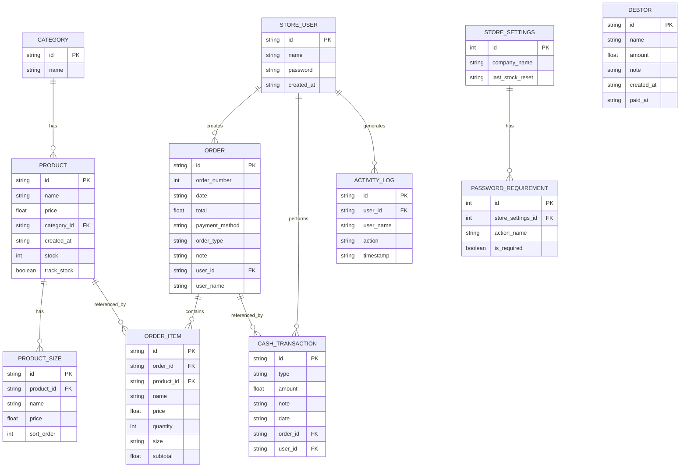

# Schema Relation Diagram

**Date:** 2026-03-17  
**Source:** backend/models.py  
**Format:** Mermaid ER Diagram  

---

## Entity Relationship Diagram

---

## Table Definitions

### categories
Stores product categories.

| Column | Type | Constraints | Notes |
|--------|------|-------------|-------|
| id | VARCHAR(36) | PRIMARY KEY | UUID string |
| name | VARCHAR(255) | NOT NULL | Category display name |

**Indexes:**
- `ix_categories_name` on `name`

---

### products
Stores sellable products.

| Column | Type | Constraints | Notes |
|--------|------|-------------|-------|
| id | VARCHAR(36) | PRIMARY KEY | UUID string |
| name | VARCHAR(255) | NOT NULL | Product name |
| price | FLOAT | NOT NULL | Base price |
| category_id | VARCHAR(36) | FK → categories.id, NULL | Nullable, SET NULL on delete |
| created_at | VARCHAR(50) | NOT NULL | ISO datetime string |
| stock | INTEGER | NULL | Only for track_stock=true |
| track_stock | BOOLEAN | NULL | Enable stock tracking |

**Indexes:**
- `ix_products_name` on `name`
- `ix_products_category_id` on `category_id`

**Relationships:**
- Many-to-One with categories (category_id)
- One-to-Many with product_sizes (cascade delete)

---

### product_sizes
Size variants for products (replaces JSON array).

| Column | Type | Constraints | Notes |
|--------|------|-------------|-------|
| id | VARCHAR(36) | PRIMARY KEY | UUID string |
| product_id | VARCHAR(36) | FK → products.id, NOT NULL | CASCADE on delete |
| name | VARCHAR(100) | NOT NULL | Size name (e.g., "Large") |
| price | FLOAT | NOT NULL | Size-specific price |
| sort_order | INTEGER | NOT NULL, DEFAULT 0 | Display order |

**Indexes:**
- `ix_product_sizes_product_id` on `product_id`

---

### users
Application users.

| Column | Type | Constraints | Notes |
|--------|------|-------------|-------|
| id | VARCHAR(36) | PRIMARY KEY | UUID string |
| name | VARCHAR(255) | NOT NULL | Display name |
| password | VARCHAR(255) | NULL | Optional password hash |
| created_at | VARCHAR(50) | NOT NULL | ISO datetime string |

---

### activity_log
Audit trail of user actions.

| Column | Type | Constraints | Notes |
|--------|------|-------------|-------|
| id | VARCHAR(36) | PRIMARY KEY | UUID string |
| user_id | VARCHAR(36) | FK → users.id, NULL | SET NULL on delete |
| user_name | VARCHAR(255) | NOT NULL | Denormalized for display |
| action | TEXT | NOT NULL | Action description |
| timestamp | VARCHAR(50) | NOT NULL | ISO datetime string |

**Indexes:**
- `ix_activity_log_timestamp` on `timestamp`
- `ix_activity_log_user_id` on `user_id`

---

### orders
Customer orders.

| Column | Type | Constraints | Notes |
|--------|------|-------------|-------|
| id | VARCHAR(36) | PRIMARY KEY | UUID string |
| order_number | INTEGER | NOT NULL | 1-100 rollover, NOT UNIQUE |
| date | VARCHAR(50) | NOT NULL | ISO datetime string |
| total | FLOAT | NOT NULL | Order total |
| payment_method | VARCHAR(20) | NOT NULL | 'cash' or 'shamcash' |
| order_type | VARCHAR(20) | NOT NULL | 'dine_in' or 'takeaway' |
| note | TEXT | NULL | Optional notes |
| user_id | VARCHAR(36) | FK → users.id, NULL | SET NULL on delete |
| user_name | VARCHAR(255) | NULL | Denormalized username |

**Indexes:**
- `ix_orders_date` on `date`
- `ix_orders_order_number` on `order_number`
- `ix_orders_user_id` on `user_id`

---

### order_items
Items within an order (historical snapshot).

| Column | Type | Constraints | Notes |
|--------|------|-------------|-------|
| id | VARCHAR(36) | PRIMARY KEY | UUID string |
| order_id | VARCHAR(36) | FK → orders.id, NOT NULL | CASCADE on delete |
| product_id | VARCHAR(36) | FK → products.id, NULL | SET NULL on delete (Decision Lock 1) |
| name | VARCHAR(255) | NOT NULL | Product name at order time |
| price | FLOAT | NOT NULL | Unit price at order time |
| quantity | INTEGER | NOT NULL | Item quantity |
| size | VARCHAR(100) | NULL | Size variant |
| subtotal | FLOAT | NOT NULL | price × quantity |

**Indexes:**
- `ix_order_items_order_id` on `order_id`
- `ix_order_items_product_id` on `product_id`

---

### cash_transactions
Cash register transactions.

| Column | Type | Constraints | Notes |
|--------|------|-------------|-------|
| id | VARCHAR(36) | PRIMARY KEY | UUID string |
| type | VARCHAR(50) | NOT NULL | 'sale', 'deposit', 'withdrawal', 'shift_close' |
| amount | FLOAT | NOT NULL | Signed amount |
| note | TEXT | NULL | Optional description |
| date | VARCHAR(50) | NOT NULL | ISO datetime string |
| order_id | VARCHAR(36) | FK → orders.id, NULL | SET NULL on delete |
| user_id | VARCHAR(36) | FK → users.id, NULL | SET NULL on delete (Decision Lock 2) |

**Indexes:**
- `ix_cash_transactions_date` on `date`
- `ix_cash_transactions_order_id` on `order_id`
- `ix_cash_transactions_user_id` on `user_id`

---

### debtors
Customer debt tracking.

| Column | Type | Constraints | Notes |
|--------|------|-------------|-------|
| id | VARCHAR(36) | PRIMARY KEY | UUID string |
| name | VARCHAR(255) | NOT NULL | Debtor name |
| amount | FLOAT | NOT NULL | Debt amount |
| note | TEXT | NULL | Optional note |
| created_at | VARCHAR(50) | NOT NULL | ISO datetime string |
| paid_at | VARCHAR(50) | NULL | Set when marked paid |

**Indexes:**
- `ix_debtors_paid_at` on `paid_at`
- `ix_debtors_created_at` on `created_at`

---

### store_settings
Application settings (single row).

| Column | Type | Constraints | Notes |
|--------|------|-------------|-------|
| id | INTEGER | PRIMARY KEY, AUTOINCREMENT | Single settings row |
| company_name | VARCHAR(255) | NOT NULL, DEFAULT '' | Company display name |
| last_stock_reset | VARCHAR(50) | NULL | Date string (toDateString format) |

**Relationships:**
- One-to-Many with password_requirements (cascade delete)

---

### password_requirements
Password requirements for sensitive actions (Decision Lock 3).

| Column | Type | Constraints | Notes |
|--------|------|-------------|-------|
| id | INTEGER | PRIMARY KEY, AUTOINCREMENT | Surrogate key |
| store_settings_id | INTEGER | FK → store_settings.id, NOT NULL | CASCADE on delete |
| action_name | VARCHAR(50) | NOT NULL | Action identifier |
| is_required | BOOLEAN | NOT NULL, DEFAULT TRUE | Password required? |

**Constraints:**
- Unique constraint on `(store_settings_id, action_name)`

---

## Referential Integrity Summary

### Cascade Delete (Child records deleted with parent)
- `product_sizes.product_id` → `products.id`
- `order_items.order_id` → `orders.id`
- `password_requirements.store_settings_id` → `store_settings.id`

### Set NULL (Preserve child, lose reference)
- `products.category_id` → `categories.id`
- `order_items.product_id` → `products.id` (Decision Lock 1)
- `cash_transactions.order_id` → `orders.id`
- `cash_transactions.user_id` → `users.id` (Decision Lock 2)
- `activity_log.user_id` → `users.id` (Decision Lock 2)
- `orders.user_id` → `users.id` (Decision Lock 2)

### Application-Level Guards
- Category deletion blocked if products exist (current behavior preserved)

---

## Index Coverage

All indexes support hot queries identified in Task 1 audit:

| Index | Supports Query From Audit |
|-------|---------------------------|
| `ix_orders_date` | Orders filtered by date range (Section 5.1) |
| `ix_orders_order_number` | Orders filtered by orderNumber (Section 5.1) |
| `ix_products_name` | Products filtered by name (Section 5.2) |
| `ix_products_category_id` | Products filtered by category (Section 5.2) |
| `ix_debtors_paid_at` | Debtors filtered by paid status (Section 5.3) |
| `ix_cash_transactions_date` | Transaction reports by date |
| `ix_cash_transactions_order_id` | Transaction lookup by order |

---

*Generated from models.py - Task 2 Deliverable*
